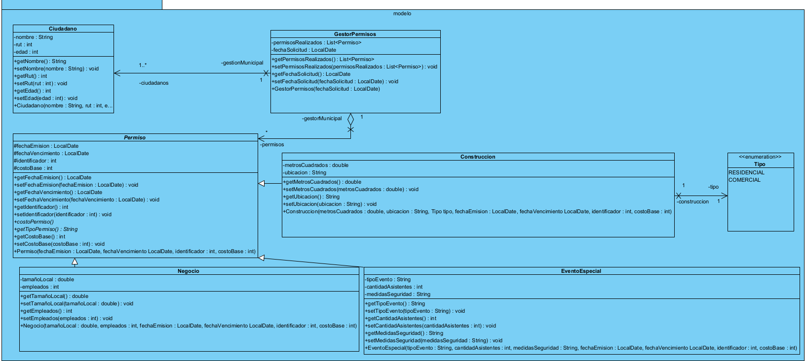
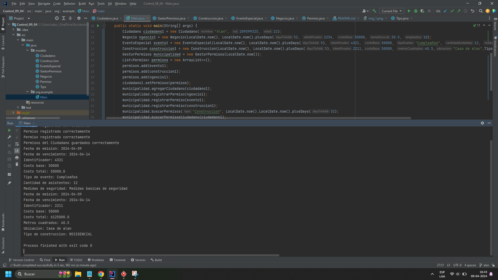

# Analisis Problematica
Mediante una clase llamada GestorPermiso voy a gestionar a las clases ciudadano y permiso, teniendo una lista de ciudadanos y una lista de permisos, ademas tendre dentro de gestor una lista de permisos realizados del tipo List<.Permiso.>.
Tendremos una clase Permiso que sera abstracta y sera la clase madre de los tres tipos de permisos que nos piden: Permiso de Construccion, Negocio y Eventos Especiales. En la clase madre tendremos las fechas de emision y vencimiento, el identificador, costo base y tres metodos abstractos: uno de los costos, ya que, cada clase hija tiene un metodo para costear diferente, un metodo abstracto getTipoPermiso que devuelve un String para poder identificar mas adelante en la solucion del problema el tipo de cada clase hija y un metodo void para mostrar los detalles de cada permiso.
En la clase Construccion tendremos los atributos metros cuadrados, ubicacion y un getTipo con un enum para saber si es Residencial o Comercial.
En la clase Negocio tendremos dos atributos: tamañoLocal y Empleados.
En la clase EventoEspecial tendremos tres atributos: tipoEvento que sera un atributo tipo String debido a que no especifica, cantidadAsistentes y medidasSeguridad que tambien sera String.

# UML DIAGRAMA

# Pruebas del programa funcionando
